# Data Science Professional Portfolio Project

## Overview

This project explores the Television show and user engagement data to evaluate its potential benefits in determing content success.

## Data preprocessing

There were multiple datasets used for investigation.

The Movie Database (TMDb) Dataset was sourced from kaggle containing roughly 150,000 records. ["Kaggle TMDb TV Shows Dataset"](https://www.kaggle.com/datasets/asaniczka/full-tmdb-tv-shows-dataset-2023-150k-shows).

The TMDb dataset was used as it provided useful TV Content information not found in the IMDb dataset. Specifically it included information such as Production companies that proved useful to analysis. Important to note is that the TMDb contained it's own user metrics figures, though limited compared to the IMDb dataset.

IMDb data was downloaded straight from IMDb's public datasets. These can be found here ["IMDb Public Datasets"](https://datasets.imdbws.com/).

The IMDb datasets used were `title.basics.tsv.gz` and `title.ratings.tsv.gz`. The title basics files provide the Programme details such as name and type of content. The title ratings table provide user engagements metrics such as number of user votes and average rating for the programme.

The files were imported into local folder location and coverted into a Pandas dataframe through `pd.read_csv()`.

### Loading IMDb Dataset and cleaning

Intial exploration into IMDb data found that there were multiple records for the same primary name. For example it was shown that for `Game of thrones` there were multiple records relating not just to the show overall show but each individual episode. 

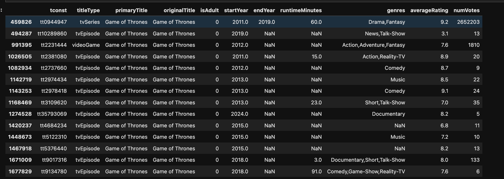

To focus on relevant information the dataset was filtered to focus on relevent TV show data. Example code is shown below:

```python
# Create a list of TV content to keep
keep_types = [
    "tvSeries",
    "tvMiniSeries",
    "tvShort",
    "tvSpecial"
]

# Filter IMDb dataset to only TV content
imdb_joined = imdb_joined[imdb_joined["titleType"].isin(keep_types)]
```

Even with this filtering applied there were still records sharing the same title. Therefore the IMDb dataset was further filtered to retain the record with the highest number of user votes. This is because one of the key aims of the exploration is to evaluate user engagement on TV show performanc, therefore programmes versions with the highest user engagement would provide the most use. Additionaly retaining all the duplicate records would negatively impact model peformance later down the line. Example code shared below:

``` python
imdb_clean = (
    imdb_joined
    .sort_values("numVotes", ascending=False)
    .drop_duplicates(subset="primaryTitle", keep="first")
)
```

### Loading TMDb Dataset and cleaning

The TMDb dataset was explored to understand it's values and breakdown. 

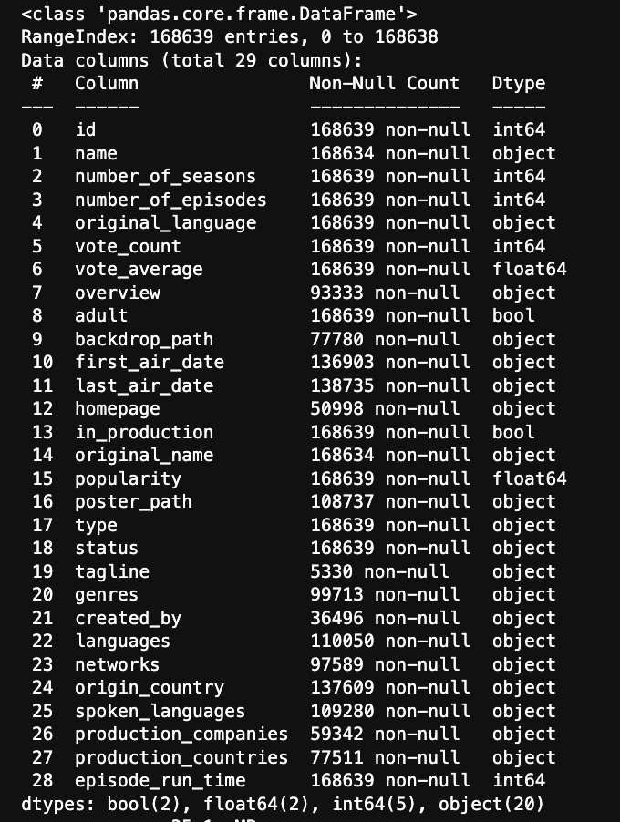

While exploring it was noticed that there were actions that needed to be done with the dataset. 

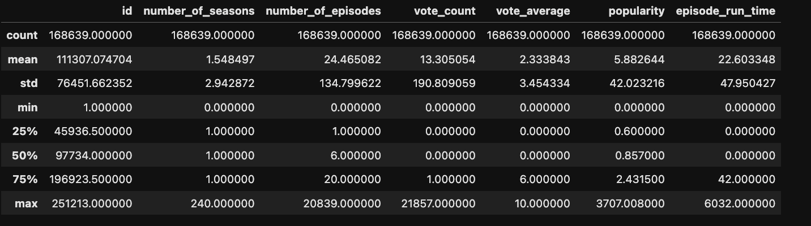

First it was shown that the date columns were not saved as a dataframe, which meant that these needed to be converted to datatimes. Additionally it was shown that 75% of the TV shows in the dataset had only 1 or less user votes. This would massively skew the data which meant that results were filtered for at least 5 votes. Additionally filtering was also applied such as focusing only on English language shows for comparability and for shows created from 2015 so that more recent changes can be analysed. Number of seasons was also filtered as it seemed to show some extreme outliers.

```python
# Apply filtering on the tmdb dataset

# Convert the first air date to a datetime column
tmdb_data["first_air_date"] = pd.to_datetime(
    tmdb_data["first_air_date"],
    dayfirst=True,
    errors="coerce"
)

# Retrieve year from the first air date column
tmdb_data["first_year"] = tmdb_data["first_air_date"].dt.year

# Filter results for shows that were first aired from 2015 onwards 
tmdb_data = tmdb_data[
    tmdb_data["first_year"] >= 2015
]

# Filter results to those that equal to or less than 11 seasons
tmdb_data = tmdb_data[
    tmdb_data["number_of_seasons"] <= 11
]

# Filter shows that have at least 5 votes
tmdb_data = tmdb_data[
    tmdb_data["vote_count"] >= 5
]

tmdb_data.head()
```
Finally null values in the genre and spoken language were removed to maintain data integrity.

### Merging TMDb and IMDb datasets

As there was no id number that could be used across both the TMDb and IMDb dataset. Instead the programme name was used as it as already predefined by companies. Before the datasets were merged the text columns were normalised to make joining work.

```python
# Make sure that the merging column is cleaned and roughly identical across both datasets
imdb_clean["primaryTitle"] = imdb_clean["primaryTitle"].str.strip().str.lower()
tmdb_cleaned["name"] = tmdb_cleaned["name"].str.strip().str.lower()
```
A subset of each dataset was created to determine which columns would be relevant to keep for each dataset. The dataset were joined through an inner join to retain matching records between both datasets. There were roughly 3900 records after cleaning and merging the two datsets, which is a large decrease from the 150,000 shows at the start of the exploration.

## Feature Engineering

This breaks down some of the feature engineering steps taken on the dataset to create reusable metrics for future analysis.

### Logarithmic transformation

Analysis on the distribution of number of votes found that there was a great positive skew of data to the low records. This means that in isolation it would not make the column effective For analysis. 

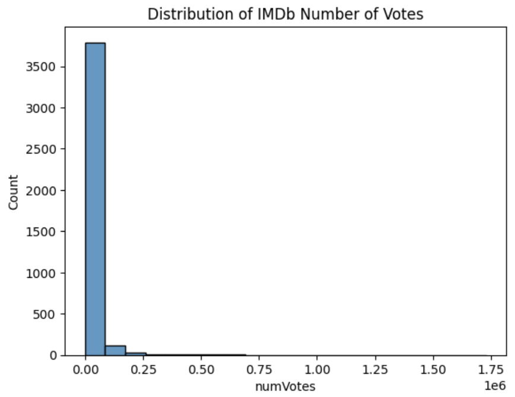

To overcome this issue a logarithmic transformation was applied to the work to limit the influence of the extreme positive skew. Following the transformation the user votes became more reflective of a normal distribution.

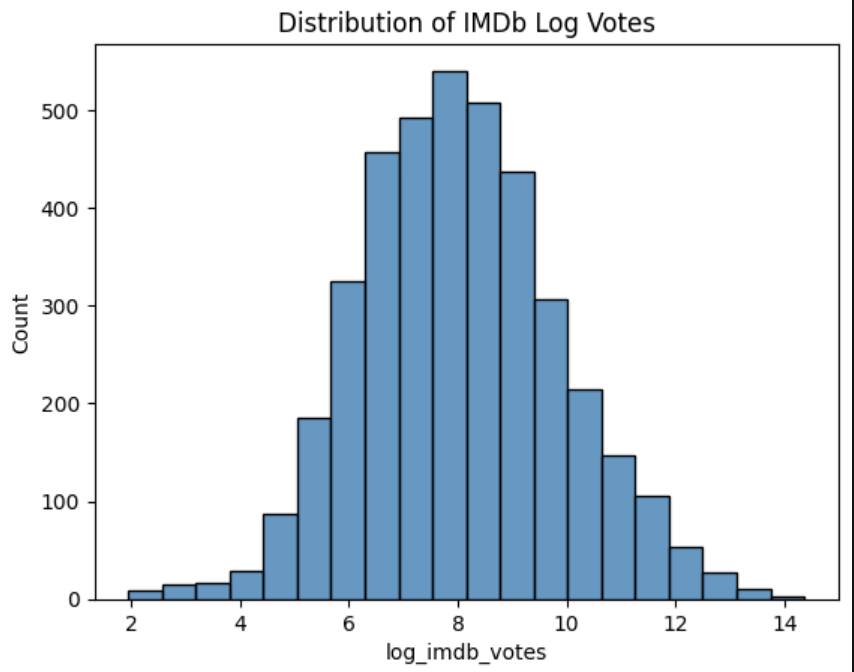

### Custom metric calculation

To limit variance, values across different columns were standardised before creating a customer success metric. Values were standardised using a `StandardScaler()` operation as this shofts the distrbution of results so that the mean is 0. This maakes the values more standardised and easier to manipulate for future score creation.

After standardisation a quality score was created using average TV show ratings from both IMDb and TMDb datasets. The IMDb rating was given a higher weight due to it having greater number of user reviews on average. The same process was applied to the engagement score but user votes were used instead.

```python
merged_lean["quality_score"] = (
    0.7 * merged_lean["imdb_rating_scaled"]
    +
    0.3 * merged_lean["tmdb_rating_scaled"]
)

merged_lean["engagement_score"] = (
    0.7 * merged_lean["imdb_votes_scaled"]
    +
    0.3 * merged_lean["tmdb_votes_scaled"]
)
```

## Hypothesis 1: Correlation Between engagement score and Quality score

This section tested the relationship between the two newly create engagement and quality metric to evaluate whether they were both correlated. A Pearson correlation was called on the dataset. It found that:

```
Correlation: 0.3292518436816032
P-value: 6.165477634591279e-101

```
Suggesting that there is a moderate positive relationship between user engagement and and overall TV show score. Though this was significant the R-squared value that the impact on the value was relatively small. The result showed that `R-squared: 0.108` suggesting that user engagement only contributed roughly 10% to overall quality score values.

A scatter graph was created to easily visualise the relationship between the two variables. 

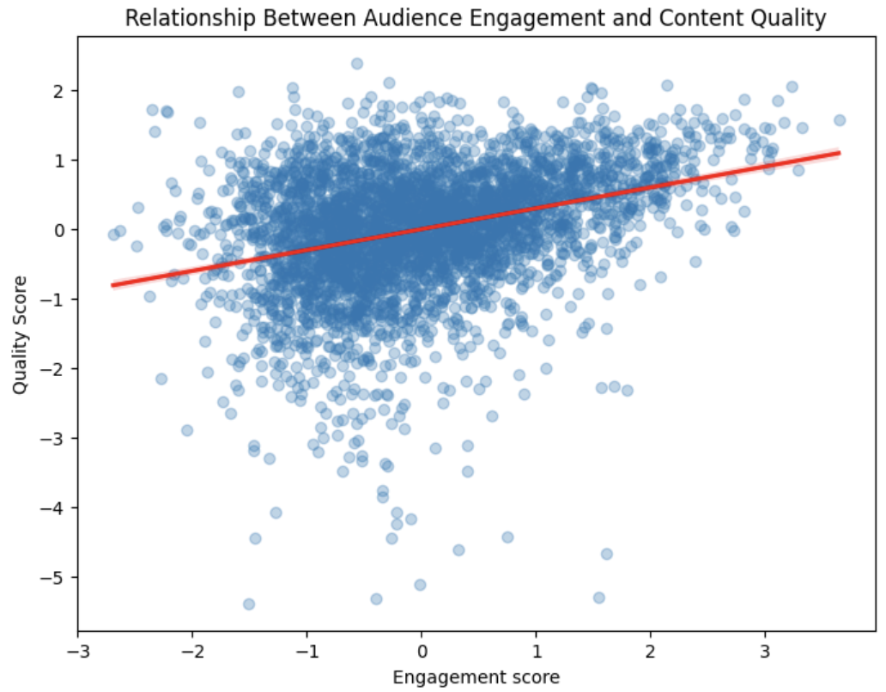


## Hypothesis 2: Success score are different across different genres

This section focused on investigating whether different genres influence content success outcomes.

### Content success metric

As shown with the previous section there are positive correlations between user engagement scores and content quality scores. A success metric was created to combine the two different metrics together with equal weighting. This would allow investigation of TV shows that are highly engaged by users but also produce high quality content. 

```python
# Generate a success score based on quality and engagement score
merged_lean["success_score"] = (
    0.5 * merged_lean["quality_score"] +
    0.5 * merged_lean["engagement_score"]
)
```

The two metrics were given equal weighting and a distribution of the values were plotted. The distribution showed that the metric was evenly distributed. 

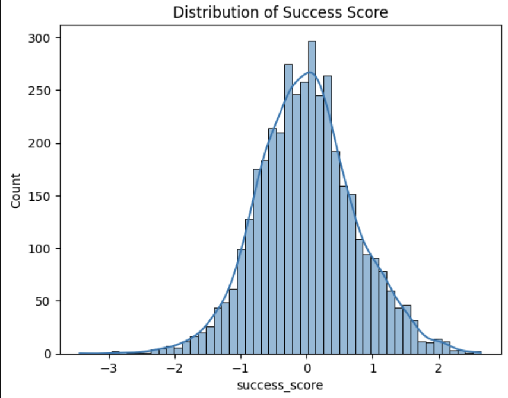

### Genre feature engineering

On inspection of the genre column it was found that some shows contained lists of multiple values. This would make it difficult to evaluate success across each individual genre.

```python
# Create a copy of the merged Lean table
genre_df = merged_lean.copy()

# Split the genres by commas
genre_df["genres"] = genre_df["genres"].str.split(",")

genre_df = genre_df.explode("genres")

# Removes trailing spaces form the string genres column
genre_df["genres"] = genre_df["genres"].str.strip()
genre_df
```

The above code was implemented to split genres into different rows. This would duplicate some shows however each genre would be retained which would make it easier for manipulation in the future. Initial thoughts were to retain a primary genre column however it was not possible to determine which genre for shows were the primary genre. Therefore all records were retained.

### Genre evaluation

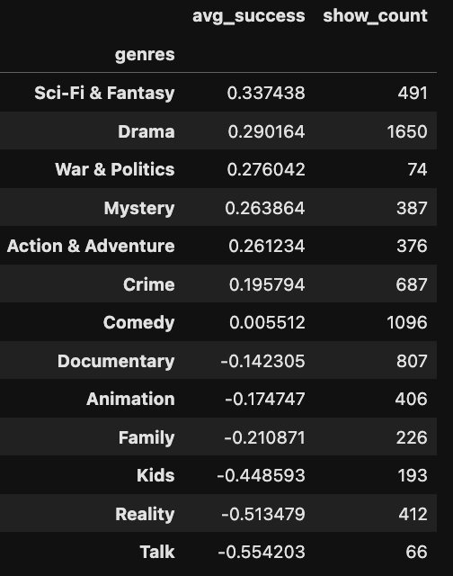

The above table filters for genre counts that are greater than 25. This is to limit the effects of genres that have little reviews and could create more unreliable results. The table shows that Drama and Sci-Fi & Fantasy produced the highest average content success scores, suggesting that these two genres are more often linked with content success. 

A one-way ANOVA was conducted on the genre resulting in `F = 74.1016332363265, P = 2.2016859871426544e-171`. This suggests that at least one genre is statistically significant from others. Therefore, some genres do impact the content success of some shows. The above metric is difficult to intuitively understand which led to the creation of the box plot show below to more quickly disseminate the information.

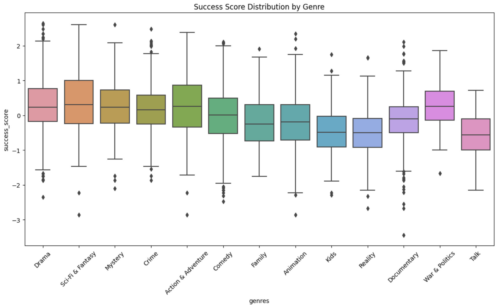


## Hypothesis 3: Success score can be predicted from Programme characteristics

This section created a prediction model to investigate whether content success can be predicted from TV programme information. 

### Feature improvement

To better predict content success of TV shows additional metrics were needed. First it was found to be useful to include both the number of seasons and the number of episodes. The number of seasons were shown to have a negative exponential distribution which is to be expected as only a few shows ever go beyond 8 seasons. The number of episodes however had an extrememly positive skew, similar to the vote counts seen previously. To clean this a logarithmic transformation was applied which made the results more evenly distributed.

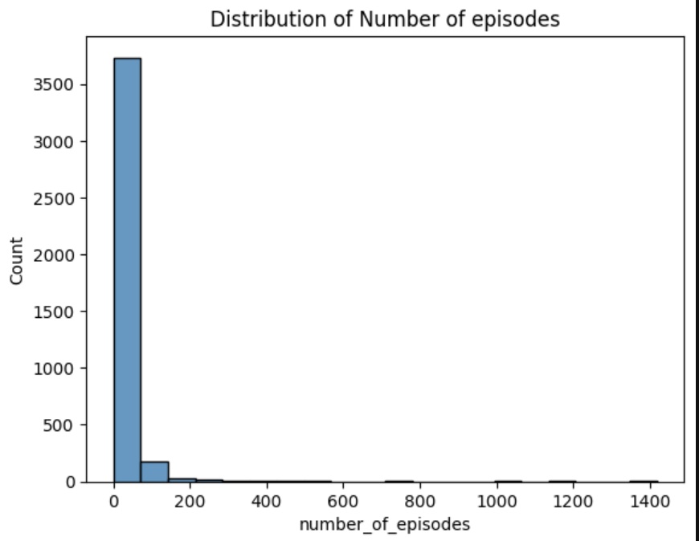
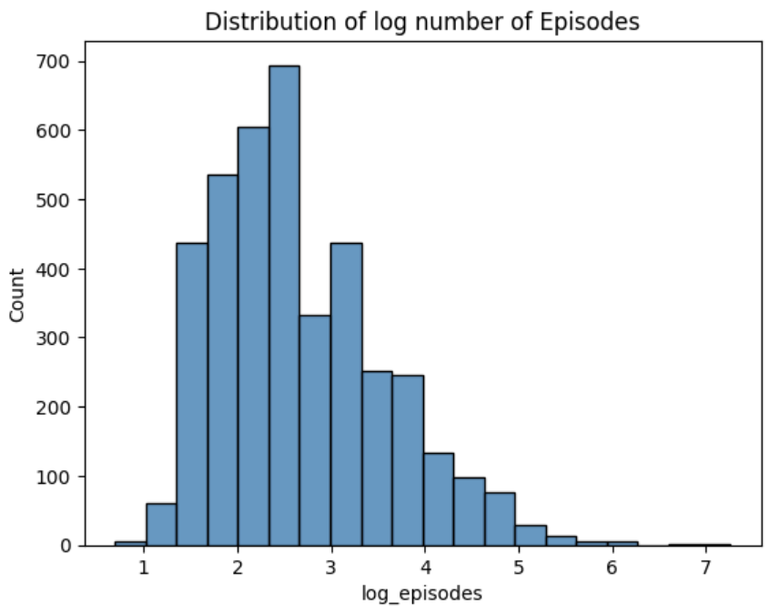

### Genre and Production company enrichment

As mentioned previously the genre column contains multiple records in one row for some shows. However unlike before we can't explode the genre results as this would create unnecessary skew on the data. 

```python
# Split the genre column based on the comman separator
merged_lean["genres"] = (
    merged_lean["genres"]
    .apply(
        lambda x: [
            g.strip().title()
            for g in x.split(",")
            if g.strip()
        ]
    )
)
```
The above code covert the string values into a list so that they can be easily manipulated for analysis. Counts were craete for each genre and again genres below a certain count were excluded. The resulting genres were then fed through a `MultiLabelBinarizer()` to provide numerical representations for where the genre values are present. This manipulation makes the genre dataset ready for use in the multiple linear regression model. 

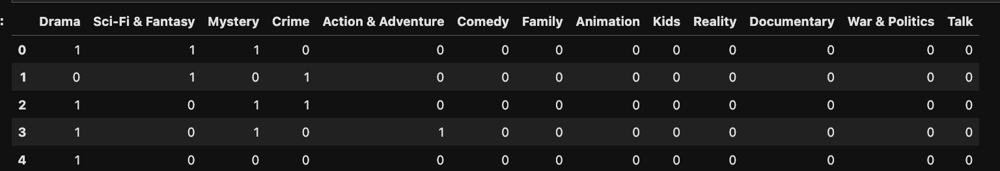

The process was taken for production companies which also had multiple values in one string. Companies however were filtered for those that had created 15 shows and above as there were a larger range of production companies. Additionaly, some of values for production companies were not present and so subsequently removed from the dataset. 

### Model fitting and prediction

The dataset was split between a training and testing set. The features were fed to the multiple linear regression model and the resulting statistics were recoded. They are shared below:

```
R² = 0.256
MAE = 0.517
RMSE = 0.665
```

The results show that the predictive model achieved a R-squared value of 0.256, suggesting that the model can explain roughly 25.6% of TV content success. The model also achieved a mean absolute error (MAE) of 0.517 and a root mean squared error (RMSE) of 0.665. This suggest that though the programme characteristics used are powerful in predicting the success of a show, there are many other factors not included in the model that could contribute to success. This is as expected as numerous were unable to be included such as TV show marketing spend, budgets and cast popularity. Therefore, the model should be used as decision support tool rather than a definitive solution. 

The coefficients that provided the greatest effect on the prediction model were returned, these are shown below:

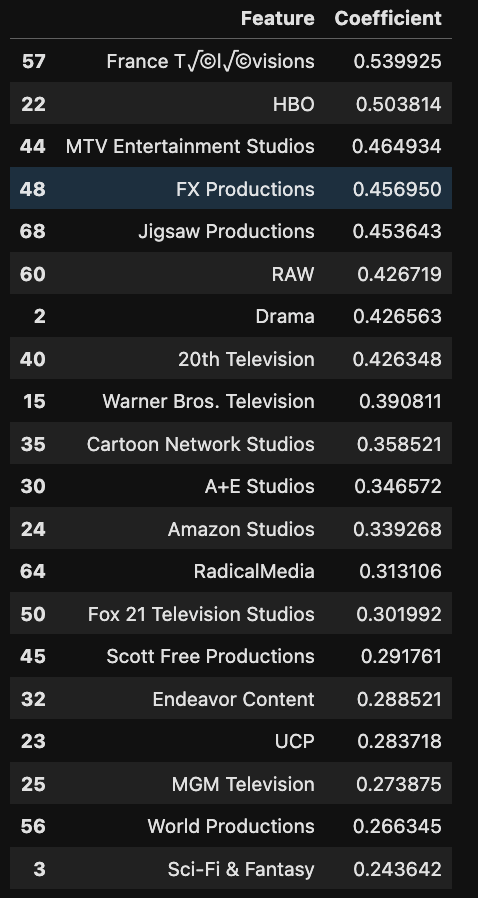

As shown, many studios can provide a substantial impact on a TV shows success. Particularly HBO has been noted as a production company with an extremely successful repertoire. It would be beneficial for a media/ streaming company to create shows alongsides successful production companies, like HBO, to produce successful content that engages with a wider audience. 

## Recommendations for future
After completing the investigations numerous recommendations have been identified for future analysis. These are:

1. Incorporating additional metrics such as cast popularity and budget to improve success of the model.
2. Include global shows to investigate TV trends globally and identify universal trends.
3. Investigate shows across a more recent timeframe to evaluate cultural changes.
4. Experiment with alternative models that could enhance predictive power.

## Appendix
1. ["Kaggle TMDb TV Shows Dataset"](https://www.kaggle.com/datasets/asaniczka/full-tmdb-tv-shows-dataset-2023-150k-shows).
2. ["IMDb Public Datasets"](https://datasets.imdbws.com/).